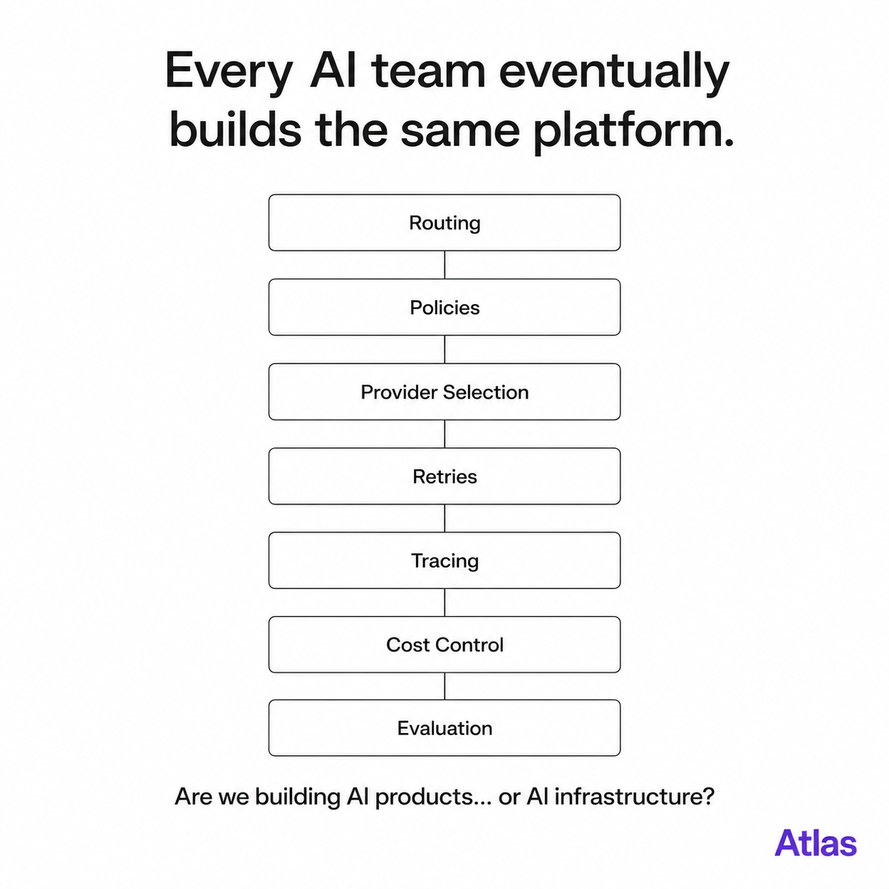

<p align="center">
  
</p>

<h1 align="center">
Atlas
</h1>

<p align="center">
<b>The Control Plane for AI Model Decisions.</b>
</p>

<p align="center">
Stop rebuilding AI infrastructure.<br>
Start building AI products.
</p>

<p align="center">


</p>

---

<p align="center">

</p>

---

# Why Atlas?

Modern AI applications are quietly becoming AI platforms.

Every engineering team eventually rebuilds the same infrastructure:

- Model Routing
- Provider Abstraction
- Retry & Fallback
- Policy Enforcement
- Cost Control
- Tracing
- Evaluation
- Governance

Instead of shipping AI products...

engineering teams spend months building AI infrastructure.

Atlas exists to standardize this layer.

---

# Vision

Atlas is **not another model wrapper.**

Atlas is **not another AI framework.**

Atlas is **not another agent library.**

Atlas is the **Control Plane for AI Model Decisions.**

Atlas enables engineering teams to control how models are selected, executed, evaluated and governed—without building an internal AI platform from scratch.

---

# What Atlas Solves

| Problem | Atlas |
|----------|:------:|
| Provider Lock-in | ✅ |
| Manual Model Routing | ✅ |
| Provider Abstraction | ✅ |
| Policy Enforcement | ✅ |
| Retry & Fallback | ✅ |
| Cost Control | ✅ |
| Routing Observability | ✅ |
| Unified API | ✅ |

---

# Architecture

```text
                        Application
                              │
                              ▼
                         Atlas SDK
                              │
                              ▼
                        Atlas Core
        ┌────────────────────────────────┐
        │                                │
        │      Policy Engine             │
        │      Router                    │
        │      Tracing                   │
        │      Metrics                   │
        │                                │
        └────────────────────────────────┘
                              │
                              ▼
                     Provider Adapter
                              │
      ┌───────────┬───────────┬───────────┬───────────┐
      ▼           ▼           ▼           ▼
   OpenAI     Anthropic     Gemini     Ollama
```

---

# Quick Example

```python
from atlas import Atlas

client = Atlas()

response = client.chat(
    model="atlas://coding",
    messages=[
        {
            "role": "user",
            "content": "Optimize this Python function."
        }
    ]
)

print(response.text)
```

---

# Core Principles

Atlas is designed around three principles.

### Quality

Always choose the best model for the workload.

---

### Cost

Optimize successful outcomes instead of token usage.

---

### Reliability

Production-first architecture with predictable behavior.

---

# Roadmap

## Phase 1

- [x] Market Research
- [x] Product Vision
- [x] RFC-0001
- [ ] RFC-0002 Architecture
- [ ] RFC-0003 Interfaces

---

## Phase 2

- [ ] Virtual Models
- [ ] Provider Abstraction
- [ ] Policy Engine
- [ ] Router

---

## Phase 3

- [ ] Tracing
- [ ] Metrics
- [ ] Cost Policies
- [ ] Reliability

---

## Phase 4

- [ ] Smart Routing
- [ ] Evaluation
- [ ] Model Registry
- [ ] Stable Public API

---

# Why not...

| Tool | Primary Focus |
|------|---------------|
| LiteLLM | Provider abstraction |
| LangGraph | Agent workflow |
| OpenAI SDK | Single provider |
| OpenRouter | Unified API |
| Atlas | AI Control Plane |

---

# Philosophy

Atlas is built on one simple idea.

> AI engineers should build AI products.

> They shouldn't spend months rebuilding the same AI infrastructure.

---

# Current Status

Atlas is currently in **Pre-Alpha**.

The project is in the architecture and design phase.

The public API is **not stable** yet.

Feedback, RFC discussions and architecture proposals are welcome.

---

# Contributing

Atlas is being built in public.

We welcome:

- RFC proposals
- Bug reports
- Feature discussions
- Documentation improvements
- Architecture reviews

Please read **CONTRIBUTING.md** before opening an Issue or Pull Request.

---

# License

MIT License

---

<p align="center">

Built with ❤️ for the AI Engineering community.

</p>